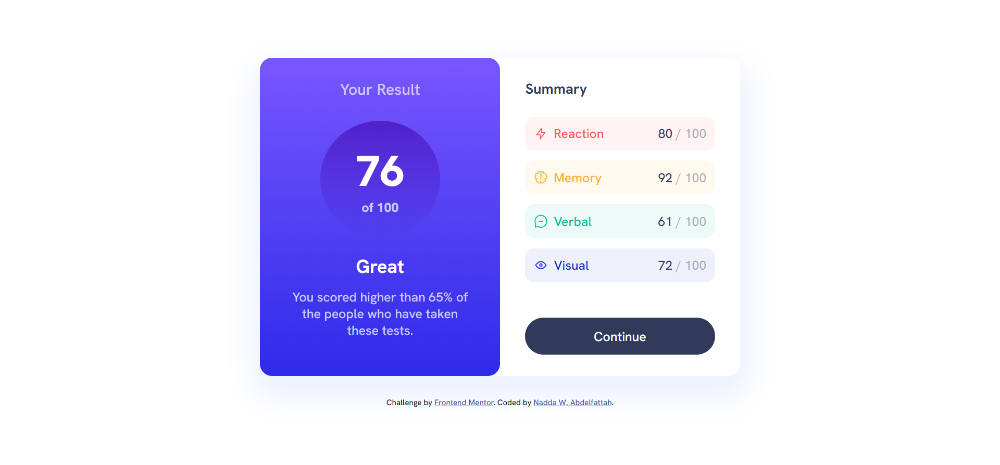
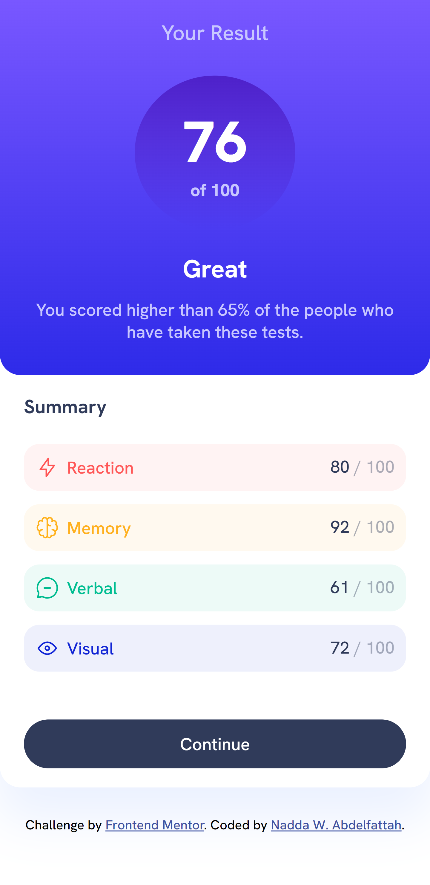

# Frontend Mentor - Results summary component solution

This is a solution to the [Results summary component challenge on Frontend Mentor](https://www.frontendmentor.io/challenges/results-summary-component-CE_K6s0maV).

## Table of contents

- [Overview](#overview)
  - [The challenge](#the-challenge)
  - [Screenshot](#screenshot)
  - [Links](#links)
- [My process](#my-process)
  - [Built with](#built-with)
  - [Useful resources](#useful-resources)
- [Author](#author)

## Overview

### The challenge

Users should be able to:

- View the optimal layout for the interface depending on their device's screen size
- See hover and focus states for all interactive elements on the page

### Screenshot

- for desktop:
  

- for mobile devices
   

### Links

- Solution URL: [GitHub](https://github.com/nabdelfattah/frontend-mentor/tree/result-summary-component)
- Live Site URL: [Netlify](https://results-summary-component-258.netlify.app/)

## My process

### Built with

- Semantic HTML5 markup
- CSS custom properties
- Flexbox
- Desktop-first workflow

### Useful resources

- [MDN Web Docs](https://developer.mozilla.org/)
- [w3schools](https://www.w3schools.com/)

## Author

- Linked-in - [Nadda W. Abdelfattah](https://www.linkedin.com/in/nadda-w-abdelfattah/)
- Frontend Mentor - [@nabdelfattah](https://www.frontendmentor.io/profile/nabdelfattah)
