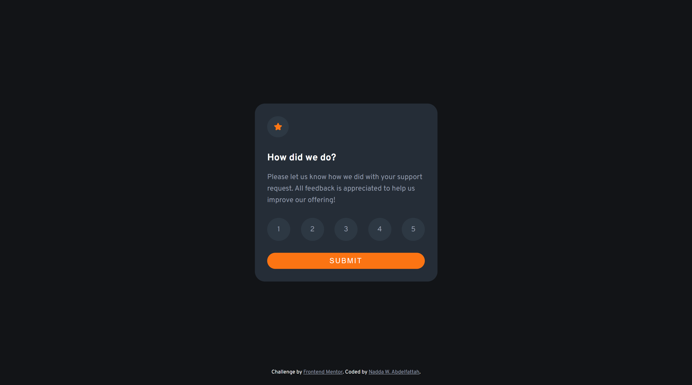
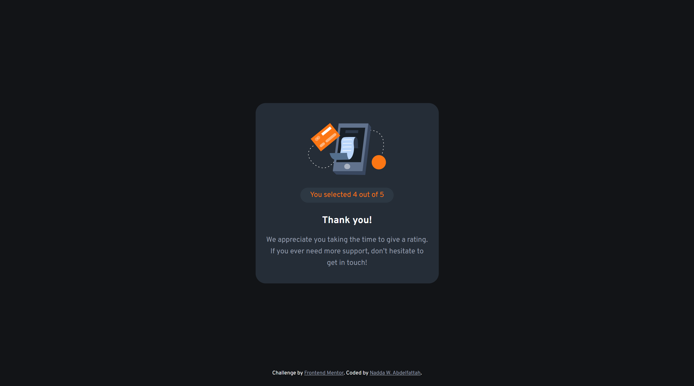
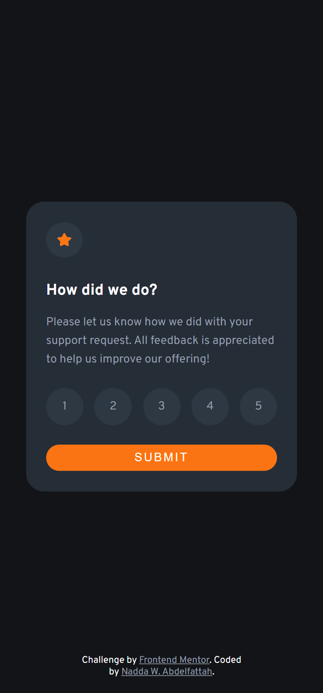

# Frontend Mentor - Interactive rating component solution

This is a solution to the [Interactive rating component challenge on Frontend Mentor](https://www.frontendmentor.io/challenges/interactive-rating-component-koxpeBUmI).

## Table of contents

- [Overview](#overview)
  - [The challenge](#the-challenge)
  - [Screenshot](#screenshot)
  - [Links](#links)
- [My process](#my-process)
  - [Built with](#built-with)
  - [Useful resources](#useful-resources)
- [Author](#author)

## Overview

### The challenge

Users should be able to:

- View the optimal layout for the app depending on their device's screen size
- See hover states for all interactive elements on the page
- Select and submit a number rating
- See the "Thank you" card state after submitting a rating

### Screenshot

- On Desktop
   
- The Thank You Card
   
- On Mobile Devices
   

### Links

- Solution URL: [Frontend Mentor](https://www.frontendmentor.io/solutions/interactive-rating-component-using-flexbox-PFudw0JLay)
- Live Site URL: [Netlify](https://interactive-rating-component-258.netlify.app)

## My process

### Built with

- Semantic HTML5 markup
- CSS custom properties
- Flexbox
- Desktop-first workflow
- Basic JavaScript

### Useful resources

- [MDN Web Docs](https://developer.mozilla.org/) - It's a documentation repository and learning resource for web developers.
- [W3Schools](https://www.example.com) - It offers courses covering all aspects of web development. W3Schools also publishes free HTML templates.

## Author

- Linked-in - [Nadda W. Abdelfattah](https://www.linkedin.com/in/nadda-w-abdelfattah/)
- Frontend Mentor - [@nabdelfattah](https://www.frontendmentor.io/profile/nabdelfattah)
- GitHub - [nabdelfattah](https://github.com/nabdelfattah)
